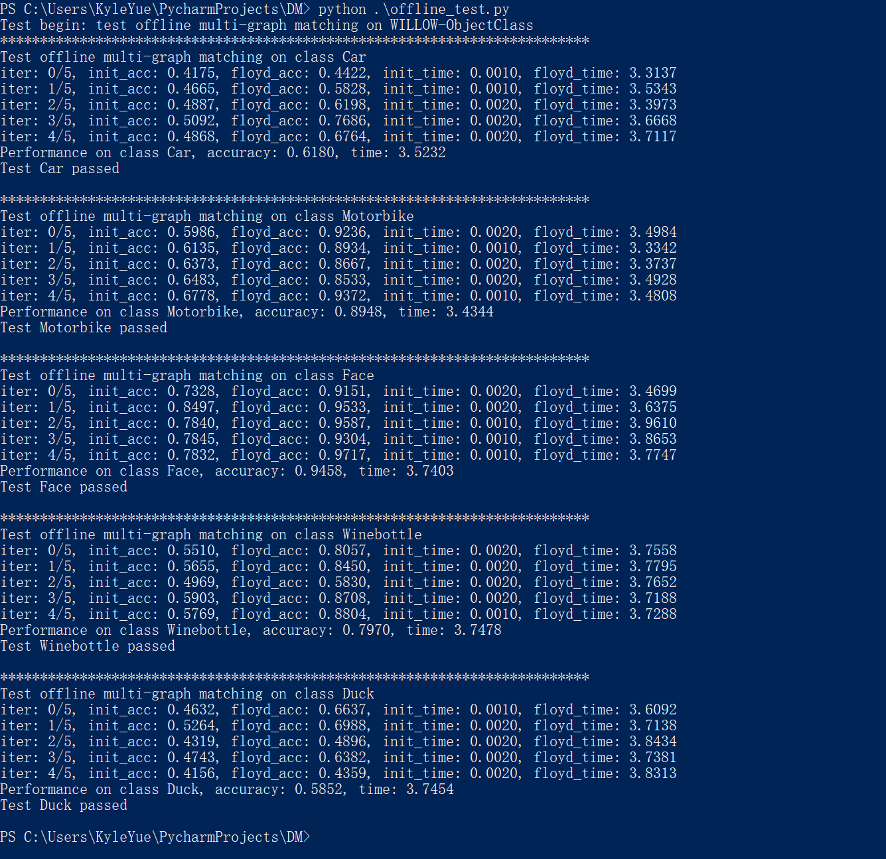
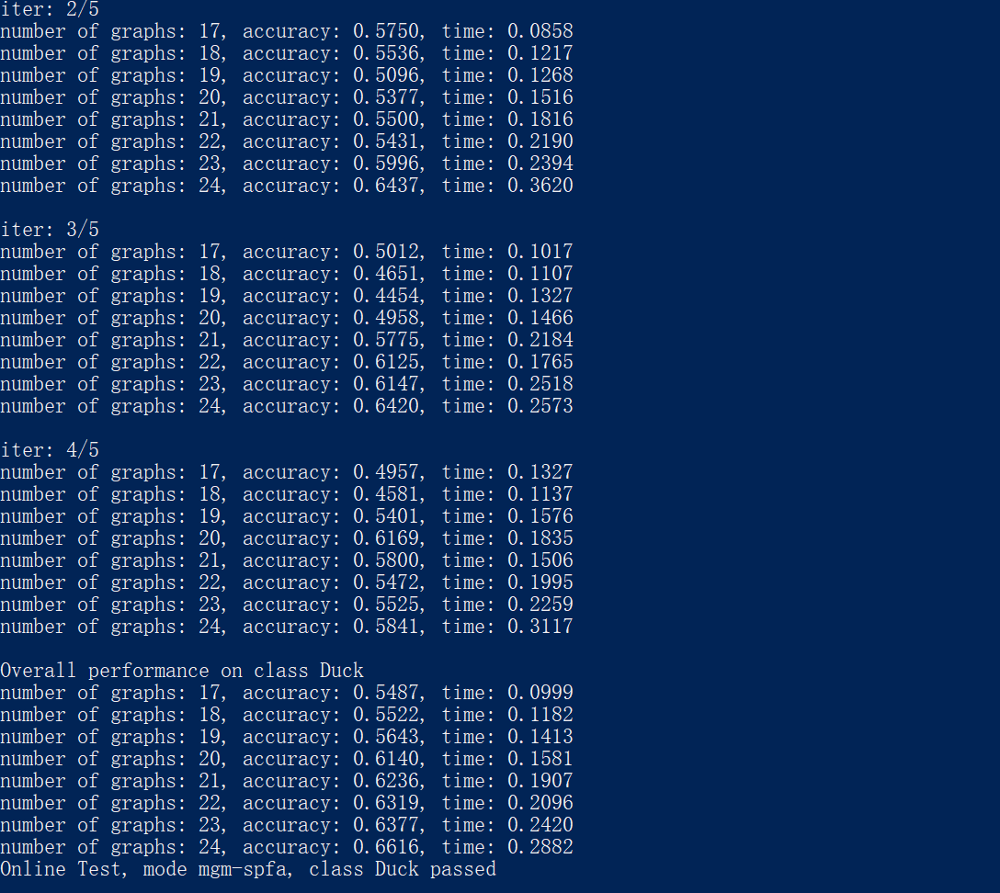
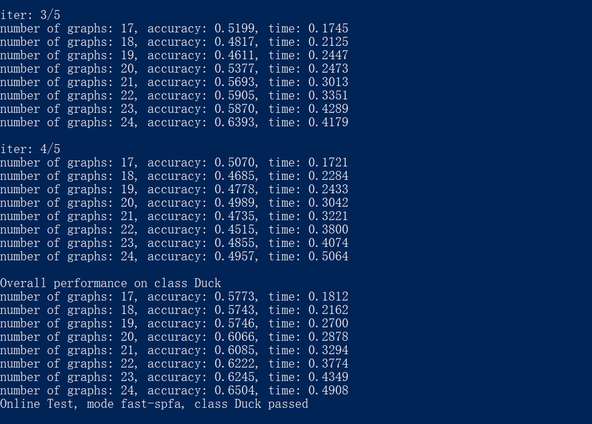

# IEEE Data Mining Homework
## Unifying Offline and Online Multi-Graph Matching via Finding Shortest Paths on Supergraph

### 目录说明
* `data/` 目录，存放 Willow-Object 数据集，以及 test 时候需要用到的 affinity matrix、initial matching 等文件。
* `src/` 目录，存放图匹配算法文件。其中，`rrwm.py` 与 `bi_stochastic.py` 不需要改动，同学们需要补全 `mgm_floyd.py`，`mgm_spfa.py`，`fast_spfa.py` 三个文件，算法输入输出要求请仔
细阅读文件中的说明。
* `utils/` 目录，存放图匹配算法以及测试所需要的一些共用函数
* `offline_test.py` 离线场景下多图协同匹配测试
* `online_test.py` 在线场景下多图增量式匹配测试

### 测试说明
运行 `python offline_test.py` 测试。Offline 测试说明，采用 Willow-Object 数据集中五个类 Car、Duck、Face、Motorbike、Winebottle，每个类 5 轮测试，每次随机选取一个类中的 24 张图，每张图有 10 个内点 2 个外点，评测精度与速度。

运行 `python online_test.py` 测试。Online 测试说明，采用 Willow-Object 数据集中五个类 Car、Duck、Face、Motorbike、Winebottle，每个类 5 轮测试，每次随机选取一个类中的 16 张图作为 base，接下来会依次到来 8 张图，每张图有 10 个内点 2 个外点，评测精度与速度。

##Testing Results:
offline test

online test mgm-spfa

online test fast-spfa

